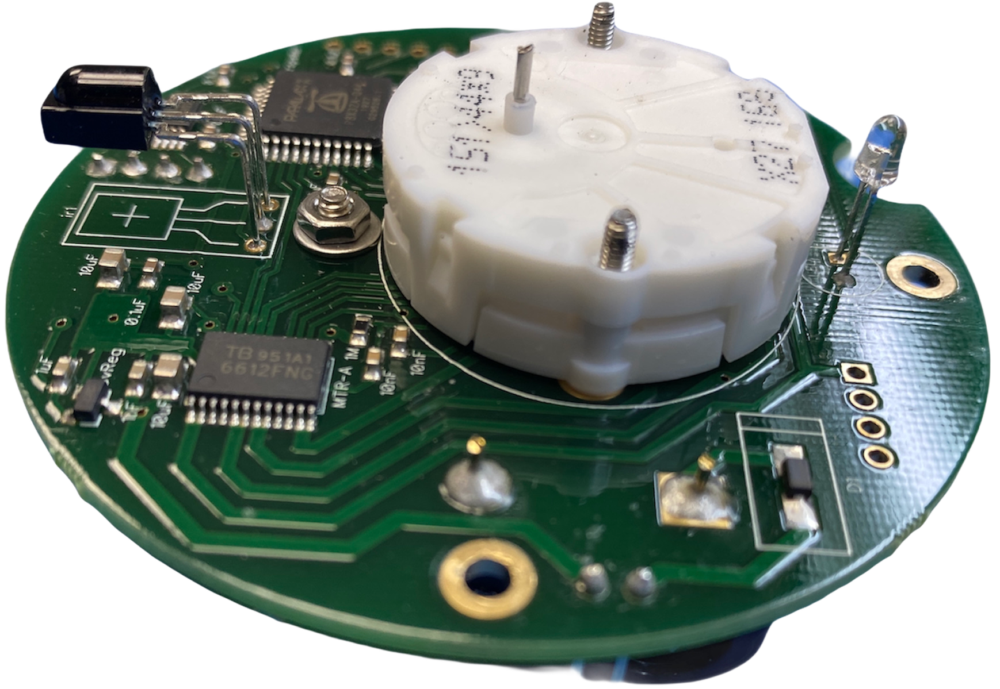
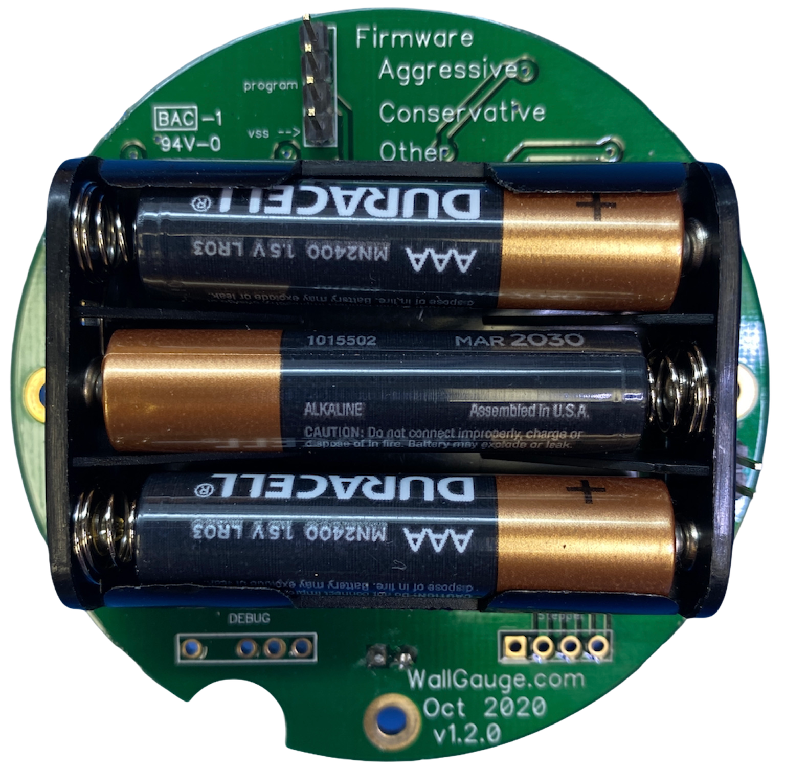
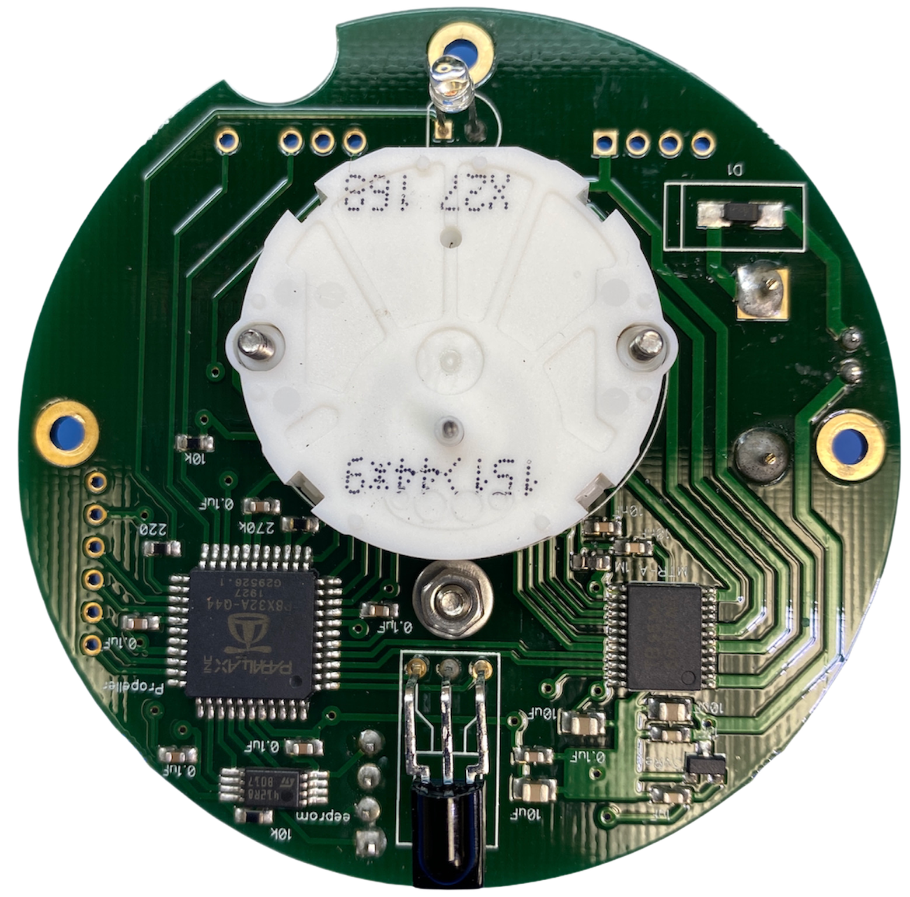

# WallGauge PCB (Analog Gauge)

## Overview

A WallGauge is a round printed circuit board housing an analog gauge (small stepper motor), infrared receiver, and a very unique processor called the Propeller from Parallax.  Firmware on the Propeller listens for commands from a Gauge Data Transmitter (GDT) and will move the needle to a physical location as instructed.  This firmware is designed to work with a gauge app running on the GDT giving us the ability to support multiple gauge types. Each gauge type can have a unique gauge face and calibration table.  This unique combination of the firmware and gauge apps makes the WallGauge system highly customizable.

## Firmware

Each WallGauge PCB can be programed (at the factory) with a unique gauge address and sleep cycle.  The gauge address is used to match the WallGauge PCB to a gauge face.  For example gauge address 20 is assigned to a Temperature gage face. 

In order to conserve energy all WallGauges are programed with a sleep cycle.  This is necessary to obtain a year plus run time on the three AAA batteries. Their are two sleep cycle configurations conservative and aggressive.  The conservative configuration is best suited for static data (data that doesn’t change much over time) like river levels.  A WallGauge running the conservative configuration can achieve a two year run time on the three AAA batteries.   The aggressive configuration is used when data is more fluid (data that changes quickly over time) like windspeed.  A gauge configured with with the aggressive firmware will have a one year battery life. 

| Firmware | Awake | Sleep | Expected Battery Life|
|----------|-------|-------|----------------------|
|Conservative|30 seconds| 300 seconds|~2 Years|
|Aggressive|10 seconds| 30 seconds|~1 Year|

### Communications

The WallGauge PCB is a receive only device.  It uses a 33kHz infrared receiver to receive data packets from a GDT. Each data packet is 32 bits in length and is encoded with a gauge address, gauge command, gauge data, and error checking. Once the WallGauge PCB receives a packet and executes the command it will immediately go to sleep.  Since the WallGauge PCB is a receive only device the GDT has no way of knowing if it is awake and ready for data. Therefore to communicate with the WallGauge PCB the GDT must constantly send out gauge commands. It constantly streams infrared data packets every 500mS to all gauges in the room. 

Battery life is dependent on the number of WallGauges your GDT is sourcing. As you add more WallGauges to your GDT the number of data packets in the transmit queue increases.   A large transmit queue will require the WallGauges to stay awake longer waiting for data packets.  This will increase the load on the battery and reduce the battery life.  Each WallGauge has an estimated battery life that is displayed in the GDT Administrator smartphone app. The actual battery life will decrease as you add more WallGauges (gauges with unique gauge addresses) to your GDT.  

If a WallGauge PCB does not receive a valid data packet at least every 20 minutes it will move the stepper motor to the full counter clockwise position.  This is the check data error position and lets the user know the WallGauge PCB is not receiving data.

## PCB Headers

There are two headers on the backside of the WallGauge PCB.  The 4 pin header is used to load the firmware at the factory.  The 2 pin header with a plus sign (+) is the power header.  A jumper must be across this header to power on the WallGauge PCB.

## Mounting

Three 2.5mm holes on the PCB can be used to mount the WallGauge PCB to your project. The stepper motor has two 2mm machine screws sticking out that can be used to hold a gauge placard. For details on the PCB hole placement see the Autocad drawing link below. You can find more information on the stepper configuration in the stepper motor specs pdf below as well. Mounting hardware (the above mention nuts and bolts) is not included.

## Batteries

Three triple A alkaline batteries (LR03) are required to power a WallGauge PCB.  We try to make sure each gauge has at least a one year battery life.  See the Firmware section above for details.  Do not modify the battery circuit. Do not try to power the WallGauge PCB from an external power source.  Do not use rechargeable batteries in the WallGauge PCB. Make sure the battery cover is securely screwed into place to secure the batteries. 

## Environment

The WallGauge PCB is designed to work inside at a comfortable room temperature.  Do not use in a high humidity environment or extreme temperatures. The target operating temperature is 65 to 80 degrees Fahrenheit.

## Handling

The WallGauge PCB is sensitive to electrostatic discharge (ESD).  You must practice proper ESD handling techniques when handling the WallGauge PCB.  Examples are using an electrostatic wrist strap and an ESD bench mat. 

## Additional information

* WallGauge PCB Autocad drawing in [DXF format](./Docs/WallGaugePCB.dxf)
* Stepper Motor Specs [PDF document](./Docs/StepperSpec.pdf)
* Infrared receiver spec sheet [PDF document](./Docs/tsop382.pdf)

